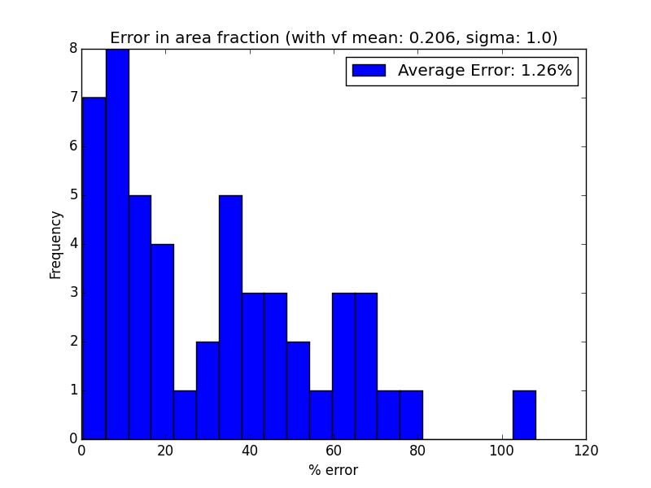

# RandomSpheres

This code uses blender envirnoment to generate a number of randomly positioned, randomly sized ellipsoids (fig1).

* Randomly sized ellipsoids.*
The original purpose behind this code was to compare volume fraction and area fraction. In this regard, a series of functions has been defined to generate a random configuration of ellipsoids in a box. After saving the value of the volume fraction, blender sections the box from a random position and saves the resultant cross-section as an image (fig2).
  
* Randomly sized ellipsoids.*
In part two of this code, a standalone python code has been used to analyze the resultant images, exctrat area fraction and compare the value to the original volume fraction value from blender and plot the results (fig3).
  
* Randomly sized ellipsoids.*
    
